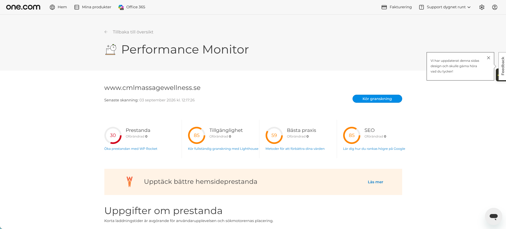

# CML Massage & Wellness — Arkitekturmigrering & Prestandarefaktorering

Produktionssajt: [cmlmassagewellness.se](https://www.cmlmassagewellness.se/)  
Teknisk stack: Vanilla PHP 8.x, Semantisk HTML5, Modern CSS (Custom Properties), GitHub Actions (CI/CD)

---

## Bakgrund & Problemformulering

Den ursprungliga webbplatsen för **CML Massage & Wellness** (Katrineholm) driftades på en WordPress-installation med page-buildern Bricks och 13 aktiva tillägg (plugins). Vid en teknisk granskning och säkerhetsaudit identifierades flera kritiska problem:

1. **Säkerhetsrisk (Nulled Programvara):** Sajten körde en piratkopierad version av temat med manuellt injicerade licensoverrides i `functions.php`, vilket blockerade säkerhetsuppdateringar och exponerade servern för potentiella bakdörrar.
2. **Extrem Prestandaförlust:** Trots att webbplatsen i grunden är en ren informations- och konverteringssida mot **Bokadirekt**, laddades onödiga Stripe-tillägg, kontaktformulärsskript och spårningsbibliotek på varje enskild sidvisning.
3. **Konverteringshinder på Mobil:** En Time to Interactive (TTI) på över 18 sekunder innebar att potentiella kunder på mobila enheter möttes av långa laddtider och låst gränssnitt.

---

## Prestanda före migrering (Baseline)

Mätning utförd via Google Lighthouse / one.com Performance Monitor på den ursprungliga WordPress-sajten:



| Mätvärde | WordPress (Före) | Målvärde (Google "Good") | Mål med Rebuild |
| :--- | :--- | :--- | :--- |
| **Prestanda (Score)** | **30 / 100** 🔴 | 90+ | **95–100** 🟢 |
| **First Contentful Paint (FCP)** | **7.31 s** | $\le$ 1.8 s | **< 0.5 s** |
| **Largest Contentful Paint (LCP)** | **9.16 s** | $\le$ 2.5 s | **< 0.8 s** |
| **Time to Interactive (TTI)** | **18.10 s** ⚠️ | $\le$ 3.8 s | **< 0.8 s** |
| **Total Blocking Time (TBT)** | **2.35 s** | $\le$ 200 ms | **0 ms** |
| **Tillgänglighet** | **85 / 100** | 90+ | **100** |
| **Bästa praxis** | **59 / 100** | 90+ | **100** |
| **SEO** | **85 / 100** | 90+ | **100** |

---

## Planerad arkitektonisk lösning

Istället för att lappa över WordPress med ytterligare cache-tillägg migrerades hela webbplatsen till en egenutvecklad, ren arkitektur byggd från grunden:

* **Noll Externa Beroenden:** Inga JavaScript-ramverk (React/Next.js/Vue) och inga CSS-bibliotek. Browsern renderar ren, semantisk HTML direkt vid första anropet.
* **Flat-File Datastruktur:** All information om behandlingar, priser och öppettider lagras i strukturerade JSON- och PHP-konfigurationsfiler (`src/data/`). Detta eliminerar databasanrop (MariaDB-latens) helt för statisk innehållsvisning.
* **Säkerhetsisolering:** Webbroten (`.htaccess`) spärrar direkt åtkomst till interna mallar och datakataloger (`/src/`), vilket förhindrar oavsiktlig exponering av konfigurationer.
* **Affärsfokus & Konvertering:** Djuplänkning direkt in i Bokadirekts bokningsflöde med automatisk hantering av UTM-parametrar och tydlig information kring friskvårdspartners (Benify, Epassi).
* **Lokal SEO & Schema:** Implementering av `HealthAndBeautyBusiness` via JSON-LD direkt i `<head>` för maximal synlighet vid lokala sökningar i Katrineholm.

---

## CI/CD Pipeline & DevOps

Projektet planeras använda en automatiserad distributionspipeline:

```text
[Lokal Utveckling] 
       │  git push origin main
       ▼
[GitHub Actions Runner]
       │  Validering & SFTP-synkning via port 22
       ▼
[one.com Produktionsserver (/webroots/www)]
```
- Känsliga uppgifter (`SFTP_HOST`, `SFTP_USER`, `SFTP_PASSWORD`) hanteras via krypterade **GitHub Secrets**.
    
- Driftsättningen tar under 5 sekunder och uppdaterar endast förändrade filer utan driftavbrott.

## Planerad projektstruktur

```text
cml-massage-rebuild/
├── .github/
│   └── workflows/
│       └── deploy.yml        # CI/CD SFTP pipeline
├── assets/
│   ├── css/
│   │   └── style.css         # Egenutvecklad responsiv CSS
│   ├── js/
│   │   └── main.js           # Minimal mobilmeny-interaktion
│   └── images/               # Optimerade WebP-resurser
├── src/
│   ├── data/
│   │   ├── salon.php         # Grunddata (öppettider, adress, bokningslänkar)
│   │   └── services.json     # Behandlingskatalog & priser
│   ├── helpers.php           # Sanitering (e()) & URL-hjälpare
│   └── templates/
│       ├── header.php        # <head>, Schema markup, navigering
│       └── footer.php        # Sidfot & kontaktuppgifter
├── .htaccess                 # Säkerhetsregler & mappskydd
├── index.php                 # Landningssida
├── behandlingar.php          # Fullständig behandlingsmeny
├── friskvard.php             # Information om Benify / Epassi
└── kontakt.php               # Hitta hit & öppettider
```

## Migrationsprocess & Dataintegritet

Innan någon ny kod driftsattes eller filer raderades upprättades en fullständig lokal säkerhetskopia av hela WordPress-miljön från one.com för att garantera noll dataförlust (bilder, media och databaskonfigurationer).

### 1. Etablering av SFTP-anslutning
Autentisering och verifiering av serverns nyckelfingeravtryck mot produktionsservern via port 22:

```bash
sftp -P 22 cirq67giw_ssh@ssh.cirq67giw.service.one
```

### 2. Fullständig spegling av Webbrot
Nedladdning av den aktiva WordPress-installationen (webroots/www) till en isolerad lokal backup-mapp:

```bash
sftp -P 22 -r cirq67giw_ssh@ssh.cirq67giw.service.one:webroots/www ~/Documents/cml_backup
```
