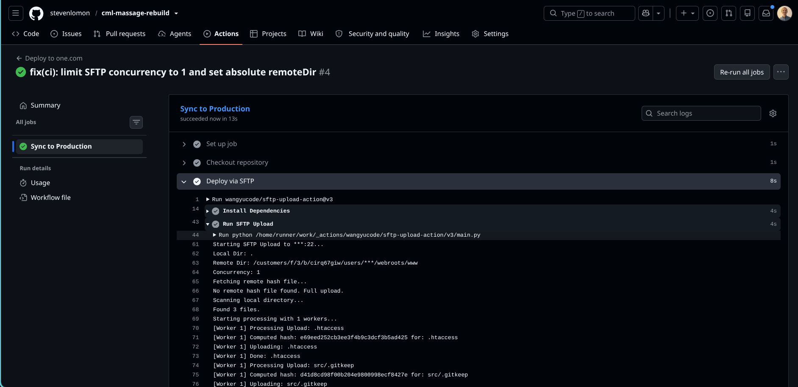

## Sep 3
  
Även med våra hemligheter satta i reopsitory:t blev det rött. Men att ändra `concurrency` till 1 och sätta den fullständiga absoluta sökvägen till remoteDir funkade för att få CI pipeline grön! Anledningen kan mycket väl vara att one.com stänger kopplingen så fort det är mer än en SFTP-anslutning i taget och med `Concurrency: 4` hade vi fyra. Viktigaste steget taget!